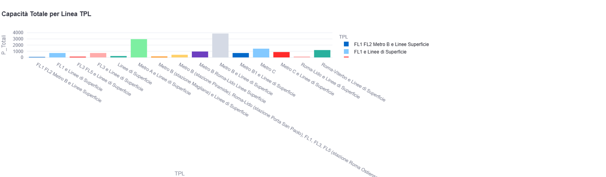
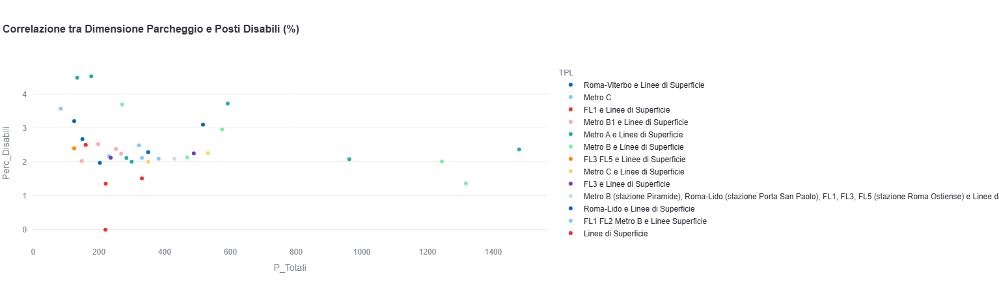

🅿️ Roma Mobility: Infrastructure Dashboard 
🎯 Obiettivo del Progetto 
Sviluppo di un'applicazione web interattiva per l'analisi dell'offerta infrastrutturale dei parcheggi di scambio a Roma. L'obiettivo è fornire uno strumento di supporto alle decisioni (Decision Support System) per analizzare la capacità di interscambio modale (Auto-Ferrovia) e monitorare l'inclusività (posti riservati ai disabili) in relazione alle diverse linee di trasporto pubblico (TPL). 
🚀 Funzionalità Principali 
KPI Executive: Visualizzazione immediata della capacità totale e dell'offerta media per parcheggio. 
Analisi dell'Offerta per Linea: Confronto interattivo tra le diverse linee TPL (Metro, Ferroviarie, Linee di Superficie). 
Correlazione Inclusività: Analisi scatter plot per valutare se la scala dell'infrastruttura sia correlata a una maggiore offerta di posti dedicati ai disabili. 
Filtri dinamici: Interfaccia intuitiva costruita con Streamlit. 
📊 Visualizzazione dell'App 
Analisi Capacità 

Descrizione: Distribuzione della capacità totale di posti auto per ciascuna linea TPL. 
Analisi Inclusività 

Descrizione: Analisi della correlazione tra dimensione totale del parcheggio e percentuale di posti disabili offerti. 
💡 Insights & Recommendations 
Dall'analisi esplorativa condotta sui dati, sono emersi i seguenti punti chiave: 
Cosa abbiamo capito (Insights) 
Concentrazione Strategica: L'offerta di parcheggi di scambio a Roma non è distribuita uniformemente. Alcune linee (come la Metro B o le linee ferroviarie FL) concentrano la maggior parte della capacità di interscambio, fungendo da veri e propri "polmoni" del sistema di trasporto cittadino. 
Correlazione Dimensionale: Dall'analisi della correlazione (Scatter Plot) è emerso che i parcheggi di grandi dimensioni non mostrano necessariamente una proporzionalità diretta nella quota di posti riservati ai disabili, suggerendo una potenziale area di miglioramento in termini di equità infrastrutturale. 
Cosa possiamo migliorare (Recommendations) 
Ottimizzazione dell'Inclusività: Per le infrastrutture di grandi dimensioni, si consiglia una revisione degli stalli riservati per garantire che l'accessibilità cresca in modo costante rispetto alla capacità totale del parcheggio. 
Potenziamento del Monitoraggio: L'attuale assenza di dati geospaziali strutturati e di dati di occupazione in tempo reale limita le possibilità di un'analisi predittiva. Una futura evoluzione del progetto prevede l'integrazione di API per il monitoraggio live e la mappatura GIS avanzata. 
Integrazione Tariffe: Un'analisi futura potrebbe correlare la tariffazione oraria con il tasso di occupazione effettivo, permettendo di identificare quali tariffe incentivano maggiormente l'uso del mezzo pubblico. 
💻 Tech Stack 
Dashboarding: Python, Streamlit 
Data Manipulation: Pandas, NumPy 
Interactive Charts: Plotly Express 
Deployment: Streamlit Community Cloud  
📁 Repository Structure 
app.py: Codice sorgente dell'applicazione Streamlit. 
parcheggi_roma.csv: Dataset pulito. 
requirements.txt: Dipendenze del progetto. 
💡 Come eseguire l'App 
Clona il repository. 
Installa le dipendenze: pip install -r requirements.txt 
Lancia l'applicazione: python -m streamlit run app.py 
